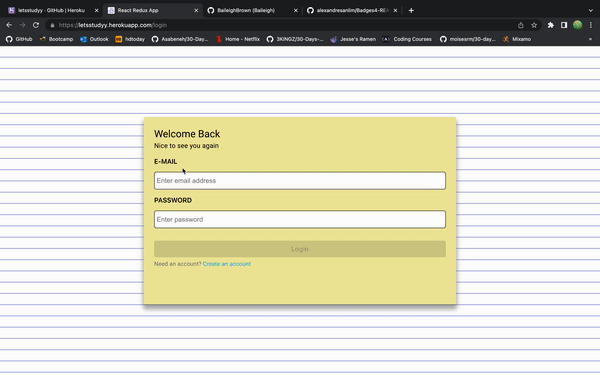

# letstudy
Group study application 

# Features 
..* Messenger 
..* Video Call (Max 4)
..* Screen Share 
..* Mute/turn off cam 
..* Add Friends 
..* Pomodoro Timer   
..* JWT Authentication  

## Technologies 

## Screenshots

## Deployed  
[Heorku](https://letsstudyy.herokuapp.com/login)

## Contact 
email: bai1eigh@outlook.com